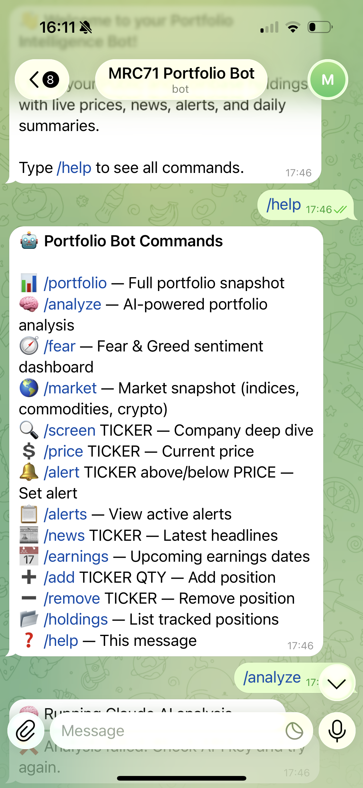
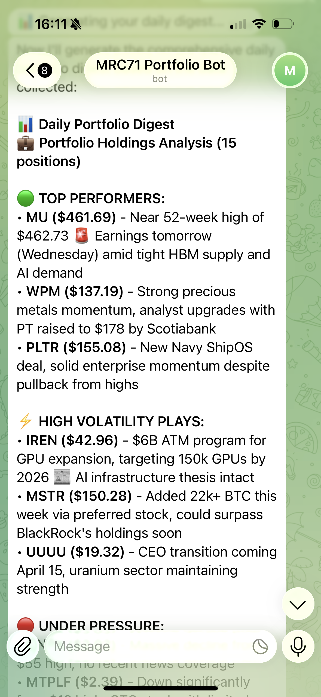
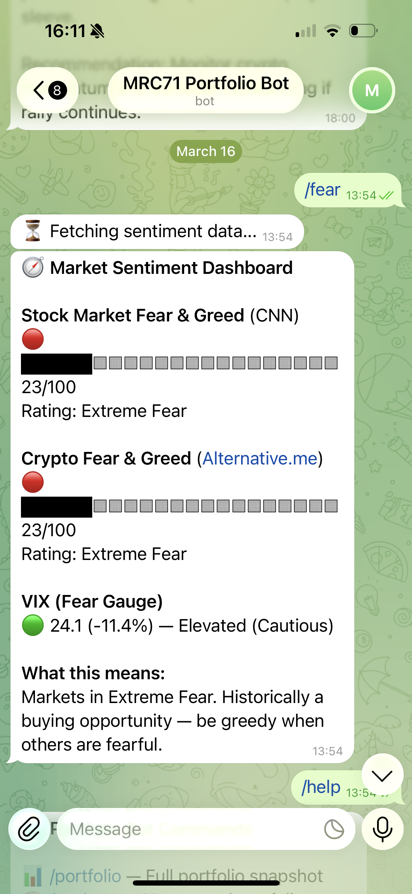

# Portfolio Analyzer Bot

A Telegram bot that uses the Claude API to synthesize news, prices, and insights — delivered via automated daily briefings and Bloomberg-style commands — to track your entire portfolio across various brokerages.

---

## Screenshots

<p align="center">
  
  
  
</p>

---

## What It Does

- **Bloomberg-style commands** — Get a full picture of your portfolio on demand with commands like `/portfolio`, `/fear`, `/market`, and `/screen`
- **AI-powered synthesis** — Claude API interprets price action and news across all your holdings to surface what actually matters
- **Unified portfolio view** — All holdings across various brokerages broken down in one place
- **Price alerts** — Set above/below triggers on any ticker so you can take action at the right moment
- **AI-generated daily briefing** — An automated snapshot of your portfolio delivered every day, no input required

---

## Tech Stack

| Tool | Role |
|------|------|
| **Python** | The engine that runs the entire program, sending commands to the APIs and routing responses back to Telegram |
| **Claude API** | The brain — interprets all signals, synthesizes news and price action into actionable intelligence |
| **Telegram Bot API** | The frontend — where commands are sent and insights are received |
| **Financial Datasets API** | Fetches live stock prices and tracks holdings (primary source) |
| **Yahoo Finance** | Gathers market news and financial data as a fallback and supplement |
| **AWS EC2** | Cloud hosting platform keeping the bot running 24/7 |
| **CoinGecko** | Crypto price data to cover gaps in Financial Datasets coverage |
| **Finnhub** | Company news and insider trade data (SEC Form 4) |
| **FRED** | Macroeconomic indicators — Fed Funds rate, 10Y Treasury, CPI |

---

## Architecture

**User-triggered flow:**
```
[Command] → [Python Bot] → [Financial Datasets / Yahoo Finance / CoinGecko] → [Claude API] → [Telegram]
```

**Automated flow:**
```
[Automated Trigger (daily briefing)] → [Python Bot] → [Financial Datasets / Yahoo Finance / CoinGecko] → [Claude API] → [Telegram]
```

**Internal module structure:**
```
bot.py → agent_loop.py → tools.py → External APIs
           ↕                ↕
        hooks.py      provider_stats.py
           ↕
    portfolio_facts.py
```

- **bot.py** — Telegram command handlers, scheduled jobs, persistence
- **agent_loop.py** — Agentic loop: Claude API calls, tool_choice enforcement, circuit breaker
- **tools.py** — Tool definitions and provider implementations
- **hooks.py** — Pre-execution safety gates (position size, irreversible actions)
- **portfolio_facts.py** — Persistent per-ticker state (cost basis, shares, digest history)
- **provider_stats.py** — API reliability tracking per provider per day
- **config.py** — Secrets, constants, system prompt, workflow config

---

## Setup

**Requirements:** Python 3.9+, AWS account, Telegram account

1. Clone the repo
2. Copy `.env.example` to `.env` and fill in your API keys
3. Install dependencies:
   ```bash
   pip install -r portfolio_bot/requirements.txt
   ```
4. Run the bot:
   ```bash
   python portfolio_bot/run.py
   ```

---

## Data Sources

| Provider | Data |
|----------|------|
| Financial Datasets | Stock quotes (primary) |
| Yahoo Finance | Stock quotes (fallback) |
| Finnhub | Company news, insider trades |
| CoinGecko | Crypto prices |
| FRED | Macroeconomic indicators |

---

## What I Learned / Future Plans

Calling APIs efficiently and using real financial data to generate meaningful output was one of the core lessons from building this. Setting up a full frontend and backend system tailored to my exact needs proved I could take a product from idea to production independently.

The goal going forward is to go deeper with the data — to the point where this bot can completely replace any paid financial app.
